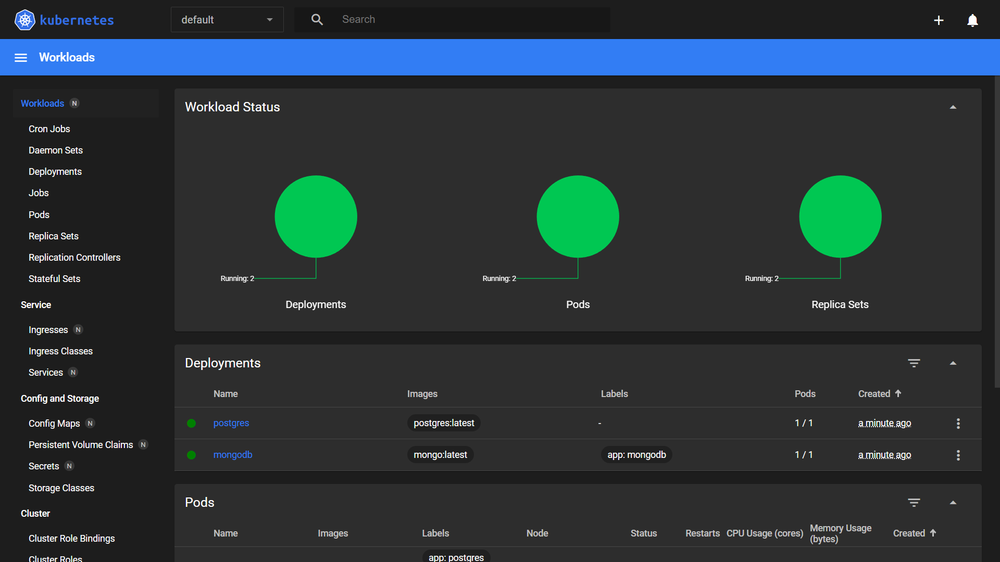

# Instruction to deploying the backend on Kubernetes
This document provides instructions on how to deploy the backend on Kubernetes.
First of all, you need to have a Kubernetes cluster running. If you don't have one, you can use [Minikube](https://minikube.sigs.k8s.io/docs/start/).
Next, you need to have `kubectl` installed. You can install it by following the instructions [here](https://kubernetes.io/docs/tasks/tools/install-kubectl/).
After you have `kubectl` installed, you can deploy the backend by running the following command:
```bash
kubectl apply -f ./mongo-storage.yaml
kubectl apply -f ./postgres-storage.yaml
kubectl apply -f ./mongo-deployment.yaml
kubectl apply -f ./postgres-deployment.yaml
kubectl apply -f ./mongo-service.yaml
kubectl apply -f ./postgres-service.yaml
kubectl apply -f ./role.yaml
kubectl apply -f ./role-binding.yaml
kubectl apply -f ./role-binding-pods.yaml
kubectl apply -f ./role-pods.yaml
kubectl apply -f ./rsa-key-pair.yaml
```
After that, open the terminal and write
```bash
minikube dashboard
```
This will open the Kubernetes dashboard in your browser. 

We should see 3 green charts. (if yellow, then wait until it turns green). If all are green, then write the following commands
```bash
kubectl apply -f ./mindglow-web-bff-server.yaml
kubectl apply -f ./mindglow-web-bff-server-service.yaml
kubectl apply -f ./mindglow-authentication-server.yaml
kubectl apply -f ./mindglow-authentication-server-service.yaml
kubectl apply -f ./mindglow-subject-server.yaml
kubectl apply -f ./mindglow-subject-server-service.yaml
```
Waiting for 3 green charts.
After that, to access the backend, you need to port-forward the service to your local machine. You can do that by running the following command:
```bash
minikube service mindglow-web-bff-server-service --url
```
This will give you a URL that you can use to access the backend.